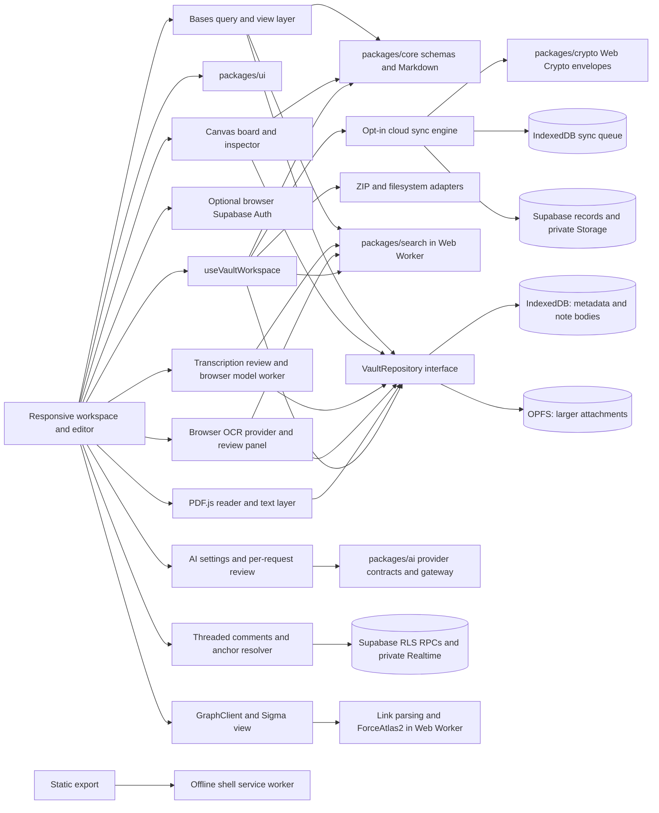

# Noor Note architecture

Public publishing uses a separate snapshot boundary: the static Next.js application manages selected pages, while a Netlify Function renders `/p/*` from RLS-protected public projection tables. It does not render private sync records. See [publishing.md](publishing.md).

Private share links use a separate table and `/s/*` Netlify Function. The function calls a narrow anonymous RPC that verifies a secret token and optional password/session before returning a single snapshot. The share table has no anonymous read grant. See [private-share-links.md](private-share-links.md).

Noor Note is a static Next.js application with a local-first vault engine. Netlify serves the app shell; normal vault operations use browser storage. Optional Supabase accounts can enable per-vault cloud sync without changing the local write path.

| Package | Responsibility |
| --- | --- |
| `apps/web` | Next.js shell, CodeMirror, vault explorer, trash, settings, browser lifecycle, ZIP and directory adapters |
| `packages/core` | Strict UUID domain schemas, safe paths, Markdown frontmatter, checksums, archive manifest |
| `packages/storage` | `VaultRepository`, Dexie schema and migrations, path reservations, revisions, OPFS fallback |
| `packages/search` | Pure query parser, inverted index, matching, ranking, and result excerpts |
| `packages/ai` | Default-off AI policy, provider contracts, note action plans, request scope validation, and approval gate |
| `packages/crypto` | Versioned AES-GCM content envelopes, passphrase and recovery key wraps, device ECDH envelopes |
| `packages/ui` | Reusable accessible controls and overlays |

The tree reads `NoteEntry` metadata and never needs every Markdown body. It groups entries by folder and windows the rendered rows for large trees. Opening a note loads its body; full-content search scans bodies on demand, then incrementally updates its index. Search and graph clients can batch-read note bodies, and the links inspector scans the vault only when opened. Link resolution uses a reusable lookup index for vault-wide scans. Graph layout runs in a worker, and Graph, Base, Canvas, and PDF views load when opened. See [large vault performance](performance.md) for measurements and limits. The editor keeps an optimistic selected note, debounces writes, serializes them in this tab, and flushes before navigation or destructive operations. A local draft supports crash recovery. The repository checks revisions before saves to detect a competing tab write.

Version history uses the existing revision table behind `VaultRepository`. The history dialog loads only one note's checkpoints; its line diff is a pure display calculation over saved Markdown. Restore and duplicate are repository operations, and restore writes a new checkpoint in the same IndexedDB transaction as the note update. ZIP archives carry checkpoint JSON separately from canonical `.md` files. See [version history](version-history.md).

The optional account layer uses a single browser Supabase client and a React session observer. Its public configuration is validated at startup; absent configuration leaves the app local-only. The static `/account/` page handles PKCE email and OAuth redirects in the browser. Authentication state is not a gate on `VaultRepository`. The separate sync engine discovers local changes, queues them in IndexedDB, and sends them only for vaults explicitly enabled by the signed-in account. See [authentication](authentication.md) and [sync protocol](sync-protocol.md).

Encrypted sync keeps the local repository and local queue unchanged. `CloudSyncEngine` seals a queued record at the upload boundary and opens a remote record before validating and applying its domain object. The cloud vault's encryption mode is immutable; a locked key prevents sync instead of falling back to plaintext. Attachment bytes are encrypted before Supabase Storage upload and decrypted after download. A separate IndexedDB database stores only wrapped local key profiles. See [encryption](encryption.md).

Collaborative notes use a second data path: `CollaborationSession` owns a Yjs document and awareness state, `CollabStore` journals updates in IndexedDB before upload, and `SupabaseCollabTransport` appends durable updates to Postgres and listens on an authorized private Realtime channel. CodeMirror binds to `Y.Text`; the workspace still autosaves the resulting Markdown locally. The ordinary snapshot sync sends the initial collaborative marker, then stops sending Markdown snapshots for a locally cached Yjs document. Plain-vault membership enables a second account to restore the vault. See [collaboration](collaboration.md).

Plaintext sharing adds invitation and role tables in Postgres; `noor_vault_role` derives the active user's role from `auth.uid()`. The sync RPC, Storage RLS, collaboration RPCs, private Realtime policies, and shared comments each check that database role. The browser's `sharing.ts` capability helpers control presentation only. Accepted membership gives access to the whole vault. `storage_owner_id` fixes the attachment namespace across ownership transfers. A vault-only scope helper rejects narrower folder and note requests until those paths are implemented end to end. See [sharing and permissions](sharing-permissions.md).

Vault, folder, note, and attachment operations remain behind `VaultRepository`. ZIP export/import and optional connected-directory writes are separate web adapters. The directory connection is a manual export, not a bidirectional mirror. Markdown remains the canonical note source. Bases use the generic structured-object store for saved configuration; rows are ordinary Markdown notes.

The Import Center uses `apps/web/src/lib/import-center.ts` for format adapters, bounded inspection, destination conflict planning, and repository writes. `ImportCenter.tsx` presents the plan before commit. Ordinary Markdown and attachments enter the existing local vault model; native Noor Note ZIPs use the existing archive importer. See [Import Center](import-center.md).

The [Export Center](export-center.md) separates export inventory, portability reporting, artifact generation, and browser delivery. It reuses the native vault ZIP and core Base/Canvas converters. Portable Markdown ZIPs stream attachment Blobs into the archive; bounded JSON, standalone HTML, CSV, and the browser print view are separate adapters. Each format has an explicit data-loss report before delivery.

`apps/web/src/lib/obsidian-vault.ts` audits links and unsupported plugin syntax within selected Markdown vault sources. Compatible JSON Canvas documents use the core importer after note and attachment writes, so file cards can bind to stable vault IDs. The report remains separate from note source. See [Obsidian-style vault import](obsidian-vault-import.md).

The desktop shell has an activity rail, sidebar file explorer, editor/workspace, optional inspector, and status bar. Mobile uses five fixed destinations (Notes, Tasks, Calendar, Search, More), a drawer containing the full navigation, file tree, and command palette entry, plus separate list/editor presentation. Search switches to the note list and focuses its local search field. The editor has a touch toolbar in its flex layout, while the note inspector becomes a scrollable bottom sheet with state separate from the desktop inspector. A `visualViewport` hook sets the visible shell height and hides the bottom bar while the software keyboard occupies the screen. Safe area spacing comes from CSS environment variables and `viewport-fit=cover`. Dense Base tables and week calendars remain horizontally scrollable; the month calendar compresses to the screen width. Canvas exposes touch-sized tools and pans when a finger drags empty board space. The workspace holds a versioned tree of panes and tabs; it supports nested vertical and horizontal splits, tab ordering, pinning, closing, and restoring a closed tab. Only the active pane has a writable CodeMirror editor. Other panes render the current saved or optimistic note state, including when the same note is open twice. The current layout is kept per vault in localStorage; named snapshots are validated Workspace records in IndexedDB and travel with full-vault ZIP exports. See [workspaces](workspaces.md). Bases, Canvas, and Calendar have workspace views; the PDF reader is a workspace overlay opened from attachments and Markdown links. Optional AI note actions use a local browser worker through the provider-neutral gateway; external assistant providers remain planned extension points. See [AI foundation](ai-foundation.md) and [feature matrix](feature-matrix.md).

`PdfReader` uses PDF.js and its worker for page rendering and text extraction. `PdfPage` owns the selectable text layer and normalized selection coordinates. `PdfAnnotationsStore` owns validated sidecar records in the repository object table. `packages/core/src/pdf-reference.ts` defines portable Markdown links, stable ID resolution, and backlink scanning. This keeps PDF bytes, note Markdown, and Noor annotation metadata separate. See [PDF reader](pdf-reader.md).

`OcrProvider` is an interface separate from the review UI and storage. The initial browser provider uses locally packaged Tesseract.js assets; no server OCR is configured. `OcrStore` stores page-level sidecars, and `SearchClient` adds their corrected text to the existing worker index as attachment results. The review panel can process a raster image or rasterize a PDF page locally. See [OCR](ocr.md).

`TranscriptionProvider` separates speech recognition from transcript review and storage. The browser provider decodes supported media audio into 16 kHz samples and sends samples to a dedicated same-origin worker running Transformers.js and Whisper. The first use downloads model weights, while the WebAssembly runtime is part of the static build. `TranscriptStore` persists validated attachment sidecars; the existing search worker indexes corrected segments with seek timestamps. See [transcription](transcription.md).

`BookmarksStore` validates typed targets and group ancestry before writing vault-scoped bookmark records. The bookmarks panel resolves note, heading, block, search, Base, Canvas, and HTTP(S) URL targets. Favorites and pinned notes are bookmark flags. Recent notes and searches are local browser preferences, while closed-tab history is stored with the workspace layout. See [bookmarks](bookmarks.md).

`packages/core/src/editor-markdown.ts` owns pure outline, wiki-reference, embed, and document-stat transforms. `apps/web` owns editor behavior and display rendering. Source Markdown remains canonical; Source, Live Preview, and Reading switch between CodeMirror and a derived rendering without rewriting the note. Editor preferences are validated and stored in browser localStorage. Reading loads local attachments and whole-line note embeds through the repository; CodeMirror keeps syntax, history, and search state in the current session.

Fenced Mermaid blocks are rendered by a shared, on-demand browser adapter in Live Preview, Reading Mode, and public publishing. The adapter keeps one restrictive Mermaid configuration, serializes render calls, and returns SVG only for display through a temporary image Blob URL. Diagram definitions remain Markdown data. See [Mermaid diagrams](mermaid-diagrams.md).

`packages/core/src/presentation.ts` derives slides and speaker notes from canonical Markdown comments. The web presentation displays each slide through `MarkdownReadingView` in a focused dialog; it neither clones CodeMirror nor persists another copy of the note. This pure slide model is the future input boundary for PDF export. See [Markdown presentations](presentations.md).

`packages/core/src/link-engine.ts` parses local links with source offsets and resolves them against stable note IDs, paths, titles, and aliases. New autocomplete links carry a portable HTML comment containing the target UUID immediately after readable wiki syntax. The inspector loads note bodies on demand to calculate backlinks, heading and block status, and unlinked mentions. It does not create a background full-text index. The repository applies a confirmed rename and its link edits in one IndexedDB transaction after checking the previewed revisions.

`packages/core/src/note-refactor.ts` plans note composition as a pure transform over loaded note bodies. The web composer presents the full plan before writing. `VaultRepository.applyNoteRefactor` validates all active note revisions, reserves new paths, and commits new notes, edited bodies, and revision checkpoints in one IndexedDB transaction. Canvas card conversion writes a validated Canvas document after checking the source revision. See [note composer](note-composer.md).

`apps/web/src/hooks/useAudioRecorder.ts` owns the browser microphone and `MediaRecorder` lifecycle; `AudioRecorder` handles local draft and saved attachment workflows. Recording metadata is an optional validated part of `Attachment`, while audio bytes use the existing IndexedDB/OPFS adapter. Saved note links remain plain relative Markdown. The core attachment-link planner and repository transaction preserve ordinary note links when recordings are renamed through the voice-note dialog. Transcription sidecars reference the attachment UUID. See [voice notes](audio-recording.md).

`packages/core/src/metadata.ts` owns YAML property parsing, typed input validation, and targeted frontmatter updates. `tag-engine.ts` derives hashtags from Markdown and YAML, builds nested counts from note summaries, and plans rename, merge, or removal operations. The tag sidebar renders derived counts; a confirmed tag operation loads bodies on demand and commits affected notes in one revision-checked IndexedDB transaction. Optional property templates live as validated `metadataSchema` objects in the generic object store. They apply only when the user requests defaults in the property panel.

The [PWA service worker](pwa.md) caches explicitly allowed public shell assets only, with optional OCR/transcription runtimes cached on first use. It never backs up notes or intercepts private APIs. Local vault access remains in IndexedDB/OPFS, and update activation waits for an editor flush. Sync keeps local writes independent of network status and distinguishes local durability from remote acknowledgement. See [sync protocol](sync-protocol.md).

Shared [activity history](activity-history.md) is a server-side derived feed for plaintext cloud vaults. Postgres triggers record committed metadata changes, invitation and permission actions, and comment actions. A small IndexedDB outbox makes revision-restore notifications retryable after offline edits. The Activity view queries authorized pages and refreshes after private Realtime invalidation.

The [web clipper](web-clipper.md) is a separate pnpm workspace under `apps/clipper-extension`. It extracts in an active-tab content script and sends a bounded validated draft to the web app's `/clipper` review route. `packages/core/src/web-clip.ts` owns the shared clip contract and portable Markdown metadata. The review route stages drafts in IndexedDB and commits through the existing vault repository; the extension has no direct database or cloud credentials.

Search uses a Web Worker bundle generated with esbuild before the Next.js build. `SearchClient` compares repository note revisions for each query, fetches only changed bodies, and sends updates to the worker. The worker owns the in-memory inverted index and returns ranked results. This avoids blocking the UI during parsing and tokenization and avoids rescanning all bodies on every keystroke. A main-thread fallback supports browsers without workers. The service worker precaches the search bundle for offline use. See [search syntax](search.md).

Semantic search uses a separate worker and Dexie database so the lexical index remains usable while a local model downloads or runs. `packages/search/src/semantic-engine.ts` owns passage segmentation, fingerprints, similarity ranking, and hybrid fusion. `SemanticSearchClient` compares vault note revisions and transfers changed bodies only; the worker reuses unchanged passage vectors by fingerprint. The pinned multilingual E5 model runs through Transformers.js and same-origin ONNX WebAssembly assets. The generic `EmbeddingProvider` contract in `packages/ai` remains the extension point for a future provider adapter; no remote adapter is registered. The semantic worker and model cache are derived data, not a vault authority. See [search](search.md).

[Vault chat](vault-chat.md) adds a local retrieval stage before the existing AI gateway. The web retrieval adapter resolves a requested note, selection, folder, Base, or vault to eligible note summaries; the local lexical search client narrows broad scopes before the passage ranker loads at most 12 candidate bodies. It ranks at most four source passages for the reviewed `AiRequestPlan`. `packages/ai/src/vault-chat.ts` validates source IDs and answer citations. The existing local chat provider receives only those passages after per-request approval. Optional conversations live in a separate Dexie database and do not alter notes or the semantic index.

[Knowledge organization](organization.md) is a web-layer local scan over bounded note bodies. Pure planners produce proposed Markdown changes; the repository applies approved changes through its atomic, revision-checked vault edit. Optional model output passes the existing gateway and a constrained, evidence-checked parser before entering the same review flow. No separate content store is introduced.

Keyboard navigation is driven by a shared `CommandRegistry` in the web app. Core commands are declared once; the palette, global hotkey listener, and shortcut settings read the same definitions. An active editor exposes its existing actions through a typed imperative handle, so commands invoke the same implementation as toolbar buttons. The quick switcher uses note and folder summaries rather than loading Markdown bodies. See [commands](commands.md).

The [knowledge graph](graph.md) derives note, tag, and attachment nodes from local metadata and Markdown links. GraphClient fetches changed note bodies on demand and a worker parses links and calculates ForceAtlas2 positions. Sigma renders the graph with WebGL, while React controls filters, local neighborhoods, and the keyboard-accessible node list. The graph does not persist or modify note content.

[Bases](bases.md) use a versioned Zod configuration in `packages/core/src/base-engine.ts`. Selection uses `NoteEntry` summaries; a search expression delegates to the offline search worker. The web Base store persists validated records in IndexedDB. Table and Kanban edits call existing note and property operations, so YAML frontmatter and Markdown remain authoritative. The ten views share the same filtered note collection.

[Charts](charts.md) extend those saved Base views. `packages/core/src/chart-engine.ts` aggregates already filtered note summaries into categorical series, scatter points, histograms, and KPI values. The web renders SVG from those results and an equivalent HTML table; source Markdown stays untouched.

[Dashboards](dashboards.md) are vault-scoped, validated layout records in the generic IndexedDB object table. Widgets read existing note summaries, tasks, bookmarks, calendar items, Bases, and shared activity. Large note-body scans run only when explicitly requested. Layout edits are saved locally and included in full-vault ZIP export.

[Noor Canvas](canvas.md) uses pure validated document operations in `packages/core/src/canvas-engine.ts`. The web Canvas store persists documents in the generic IndexedDB object table. The board draws cards in a transformed world and connectors in SVG; the inspector edits one selected object. Note and attachment cards reference vault records, so edits to source notes remain visible. JSON Canvas conversion is isolated in the core engine, including its `noor-note` metadata namespace.

`packages/core/src/formula-engine.ts` tokenizes, parses, and interprets a bounded expression grammar. It uses no JavaScript evaluation. The Base engine compiles saved formulas, evaluates them against primitive note fields and YAML properties, then passes computed values to view filters, sorting, grouping, and aggregates. Formula results remain derived data and are never stored as note properties. See [formula syntax](formulas.md).

`packages/core/src/template-engine.ts` renders variables and a bounded, allowlisted expression grammar. Template sources are regular notes inside a configured vault folder. Vault settings store only rule references for default, daily, folder, and Base creation. `useVaultWorkspace` selects the rule, loads its source Markdown, and passes a path-aware renderer to the repository; the repository reserves the final path and writes the new note and initial revision atomically. The picker shares this engine for preview, insert, create, and YAML property application. See [templates](templates.md).

`packages/core/src/form-engine.ts` validates per-Base form definitions and answers, applies safe filename and note templates, and writes YAML properties and relative attachment links. `apps/web/src/lib/base-forms.ts` loads the latest Base, validates destination/template references, saves attachments with collision-safe names, and creates a revisioned Markdown note. Base definitions persist in the existing object table and remap folder/template IDs on full-vault ZIP import. See [forms](forms.md).

`packages/core/src/study-engine.ts` parses explicit Markdown cards and opt-in heading sections and schedules reviews with a bounded SM-2-inspired rule. `apps/web/src/lib/study.ts` persists source-linked cards and review histories in the vault object table. The Study view previews imports and handles reviews locally. Card data is included in ZIP portability with source IDs remapped; structured cloud sync does not yet include it. See [study cards](study.md).

`packages/core/src/markdown-table.ts` owns GFM table location, parsing, serialization, structural operations, temporary sorting, and CSV conversion. `TableEditor` edits a local grid and applies one guarded CodeMirror range replacement, preserving the surrounding Markdown and undo history. See [Markdown table editor](table-editor.md).

`packages/core/src/period-notes.ts` owns period boundaries, ISO week numbering, filename/date formatting, validation, and portable frontmatter identity. The workspace hook locates a period by its frontmatter marker and creates one note on an explicit action or when the selected period's auto-create rule is enabled. `calendar-engine.ts` derives calendar entries and ranges from note summaries and validates portable Markdown event inputs. The web Calendar owns month/week/day/agenda interaction and Base filtering; changes go through revisioned note saves. Calendar navigation does not generate dates in bulk. See [calendar](calendar.md) and [periodic notes](periodic-notes.md).

`packages/core/src/task-engine.ts` parses structured metadata from Markdown checkboxes and updates a selected source line by stable task ID, or by checked note/line/text for legacy tasks. It computes the next recurrence instance when the dashboard completes a task. `task-query.ts` filters note-entry task summaries for built-in and saved views. The web Tasks dashboard does not keep a separate task content store; it saves edits through the revisioned note repository. Saved task queries live in vault settings. See [tasks](tasks.md).
## Plugin boundary

`packages/plugin-sdk` owns plugin manifest, contribution, and bridge schemas. `apps/web/src/lib/plugin-package-source.ts` validates packages acquired from local files and provides the source interface that a future catalog could implement. `apps/web/src/lib/plugin-host.ts` owns installed plugin lifecycles and all privileged host requests. Plugin JavaScript executes in an opaque-origin sandboxed iframe and communicates over a transferred `MessageChannel` port. Declarative contributions are rendered by Noor Note components; plugin objects are never imported into React, CodeMirror, Bases, or Canvas code. Installed bundles and namespaced settings use a separate local IndexedDB database. Development file handles stay in memory for one app session. See [Plugin SDK](plugins.md) for supported contributions and isolation limits.

## Appearance boundary

`apps/web/src/styles/tokens.css` defines the built-in light and dark values. `apps/web/src/theme/appearance.ts` validates local theme packages and compiles a restricted CSS snippet subset. `ThemeProvider` applies the active token override and enabled snippets through dedicated style elements. Local appearance state lives outside vault content in browser storage. Editor, Graph, Canvas, and Bases consume the same CSS custom properties; Graph redraws after appearance changes because its node colors are read from computed styles. See [Themes and CSS snippets](themes.md).
# Architecture
