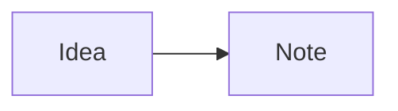

# Mermaid diagrams

Fenced `mermaid` blocks render in Live Preview and Reading Mode. The renderer supports the installed Mermaid package's flowchart, sequence, class, state, ER, Gantt, and mind-map syntax. Source Mode always shows the original Markdown. The preview includes an expandable source block, including when a diagram has a syntax error.

````markdown

````

`apps/web/src/lib/mermaid-diagrams.ts` is the shared browser renderer for note previews and public publishing. It loads on demand in the editor and serializes renders because Mermaid uses shared configuration. Noor Note fixes Mermaid to strict security, disables HTML labels and click behavior, suppresses error diagrams, and limits source to 50,000 characters and 500 edges. Diagram-level configuration directives and Mermaid frontmatter are rejected so notes cannot override these settings. Mermaid's generated SVG is loaded through a temporary Blob URL in an image element; it is never inserted as live SVG or HTML. Blob URLs are revoked when previews unmount or public images finish loading.

Rendering errors leave the definition visible as text. The generated image has a generic accessible name; the expandable source provides the diagram's content to readers who cannot use the image. Large or complex diagrams may still take time to lay out, and an image does not provide full semantic navigation through individual nodes. Independent browser security and accessibility review remains appropriate before accepting arbitrary shared content at scale.
